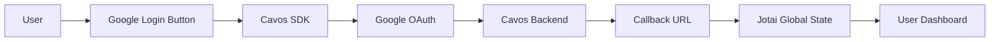

# Integration Guide: Google Login with Cavos SDK

## 📋 Executive Summary

This guide documents the complete implementation of Google authentication flow using Cavos Service SDK in a Next.js application. The system allows users to authenticate with their Google accounts and automatically obtain a Starknet wallet managed by Cavos.

## 🏗️ General Architecture



## 📦 Required Dependencies

```json
{
  "dependencies": {
    "cavos-service-sdk": "^1.2.34",
    "jotai": "^2.13.1",
    "next": "15.4.6",
    "react": "19.1.0",
    "axios": "^1.11.0"
  }
}
```

## 🔧 Environment Variables Configuration

### `.env` File
```bash
# Backend (Server-side)
CAVOS_ORG_SECRET=your_org_secret_here
CAVOS_APP_ID=your_app_id_here

# Frontend (Client-side)
NEXT_PUBLIC_CAVOS_APP_ID=your_app_id_here
NEXT_PUBLIC_STARKNET_NETWORK=sepolia  # or mainnet for production
```

**Important**: Get these credentials from [Cavos Aegis Dashboard](https://aegis.cavos.xyz/dashboard)

## 📁 Required File Structure

```
/
├── app/
│   ├── auth/
│   │   └── callback/
│   │       └── page.tsx        # OAuth callback page
│   └── page.tsx                # Main page with auth conditional
├── components/
│   └── LoginForm.tsx           # Component with Google button
└── lib/
    ├── auth-atoms.ts           # Global state with Jotai
    └── types.ts                # TypeScript interfaces
```

## 🔨 Step-by-Step Implementation

### Step 1: Define Types (lib/types.ts)

```typescript
export interface SignInResponse {
  success: boolean;
  access_token: string;
  wallet_address: string;
  network: string;
  message?: string;
}

export interface ApiResponse {
  success: boolean;
  message: string;
  data: {
    email: string;
    wallet_address: string;
    created_at: string;
  };
}
```

### Step 2: Configure Global State with Jotai (lib/auth-atoms.ts)

```typescript
import { atom } from "jotai";
import type { SignInResponse } from "./types";

export interface UserData {
  access_token: string;
  wallet_address: string;
  network: string;
}

export const userAtom = atom<UserData | null>(null);

export const isAuthenticatedAtom = atom((get) => {
  const user = get(userAtom);
  return user !== null;
});

export const signInAtom = atom(null, (get, set, signInResponse: SignInResponse) => {
  if (signInResponse.success) {
    const userData: UserData = {
      access_token: signInResponse.access_token,
      wallet_address: signInResponse.wallet_address,
      network: signInResponse.network,
    };
    set(userAtom, userData);
  }
});

export const signOutAtom = atom(null, (get, set) => {
  set(userAtom, null);
});
```

### Step 3: Implement Login Component (components/LoginForm.tsx)

```typescript
"use client";

import { SignInWithGoogle } from "cavos-service-sdk";
import type { SignInResponse } from "../lib/types";

interface LoginFormProps {
  onSignIn: (userData: SignInResponse) => void;
}

export default function LoginForm({ onSignIn }: LoginFormProps) {
  const [isLoginForm, setIsLoginForm] = useState(true);

  return (
    <div className="w-full max-w-md mx-auto">
      <div className="bg-white rounded-lg shadow-sm border p-6">
        {/* Traditional form here if needed */}
        
        {/* Social Login - Only show in login form */}
        {isLoginForm && (
          <>
            <div className="mt-6 mb-4 flex items-center">
              <div className="flex-1 border-t border-gray-300"></div>
              <div className="px-3 text-sm text-gray-500">Or continue with</div>
              <div className="flex-1 border-t border-gray-300"></div>
            </div>

            <div className="space-y-3 flex flex-col items-center">
              <SignInWithGoogle
                appId={process.env.NEXT_PUBLIC_CAVOS_APP_ID || ""}
                network={process.env.NEXT_PUBLIC_STARKNET_NETWORK || ""}
                finalRedirectUri={`${typeof window !== 'undefined' ? window.location.origin : ''}/auth/callback`}
                text="Continue with Google"
              />
            </div>
          </>
        )}
      </div>
    </div>
  );
}
```

### Step 4: Create Callback Page (app/auth/callback/page.tsx)

```typescript
"use client";

import { useEffect, useState, Suspense } from "react";
import { useRouter, useSearchParams } from "next/navigation";
import { useSetAtom } from "jotai";
import { signInAtom } from "../../../lib/auth-atoms";
import type { SignInResponse } from "../../../lib/types";

function AuthCallbackContent() {
  const router = useRouter();
  const searchParams = useSearchParams();
  const signIn = useSetAtom(signInAtom);
  const [status, setStatus] = useState<"processing" | "success" | "error">("processing");
  const [message, setMessage] = useState("Processing authentication...");

  useEffect(() => {
    const handleCallback = () => {
      try {
        // Extract data from query parameters
        const userData = searchParams.get("user_data");
        const error = searchParams.get("error");

        // Handle errors
        if (error) {
          setStatus("error");
          setMessage(`Authentication failed: ${error}`);
          setTimeout(() => router.push("/"), 3000);
          return;
        }

        // Process user data
        if (userData) {
          const decodedUserData = decodeURIComponent(userData);
          const parsedUserData = JSON.parse(decodedUserData);
          
          // Structure the login response
          const signInResponse: SignInResponse = {
            success: true,
            access_token: parsedUserData.authData.accessToken,
            wallet_address: parsedUserData.wallet.address,
            network: parsedUserData.wallet.network || "sepolia",
          };
          
          // Update global state
          signIn(signInResponse);
          
          // Show success and redirect
          setStatus("success");
          setMessage("Authentication successful! Redirecting...");
          setTimeout(() => router.push("/"), 1000);
        } else {
          setStatus("error");
          setMessage("No authentication data received");
          setTimeout(() => router.push("/"), 3000);
        }
      } catch (error) {
        console.error("Callback processing error:", error);
        setStatus("error");
        setMessage("An error occurred during authentication");
        setTimeout(() => router.push("/"), 3000);
      }
    };

    handleCallback();
  }, [router, searchParams, signIn]);

  return (
    <div className="min-h-screen bg-gray-50 flex items-center justify-center">
      <div className="text-center">
        {/* Visual status indicators */}
        {status === "processing" && (
          <div className="animate-spin rounded-full h-8 w-8 border-b-2 border-blue-600 mx-auto mb-4"></div>
        )}
        {status === "success" && (
          <div className="rounded-full h-8 w-8 bg-green-600 flex items-center justify-center mx-auto mb-4">
            <svg className="w-5 h-5 text-white" fill="none" stroke="currentColor" viewBox="0 0 24 24">
              <path strokeLinecap="round" strokeLinejoin="round" strokeWidth={2} d="M5 13l4 4L19 7" />
            </svg>
          </div>
        )}
        {status === "error" && (
          <div className="rounded-full h-8 w-8 bg-red-600 flex items-center justify-center mx-auto mb-4">
            <svg className="w-5 h-5 text-white" fill="none" stroke="currentColor" viewBox="0 0 24 24">
              <path strokeLinecap="round" strokeLinejoin="round" strokeWidth={2} d="M6 18L18 6M6 6l12 12" />
            </svg>
          </div>
        )}
        <p className={`${
          status === "success" ? "text-green-600" : 
          status === "error" ? "text-red-600" : 
          "text-gray-600"
        }`}>
          {message}
        </p>
      </div>
    </div>
  );
}

export default function AuthCallback() {
  return (
    <Suspense fallback={
      <div className="min-h-screen bg-gray-50 flex items-center justify-center">
        <div className="text-center">
          <div className="animate-spin rounded-full h-8 w-8 border-b-2 border-blue-600 mx-auto mb-4"></div>
          <p className="text-gray-600">Loading...</p>
        </div>
      </div>
    }>
      <AuthCallbackContent />
    </Suspense>
  );
}
```

### Step 5: Integrate in Main Page (app/page.tsx)

```typescript
"use client";

import { useAtomValue, useSetAtom } from "jotai";
import LoginForm from "../components/LoginForm";
import { userAtom, isAuthenticatedAtom, signInAtom, signOutAtom } from "../lib/auth-atoms";
import type { SignInResponse } from "../lib/types";

export default function Home() {
  const user = useAtomValue(userAtom);
  const isAuthenticated = useAtomValue(isAuthenticatedAtom);
  const signIn = useSetAtom(signInAtom);
  const signOut = useSetAtom(signOutAtom);

  const handleSignIn = (signInResponse: SignInResponse) => {
    signIn(signInResponse);
  };

  const handleSignOut = () => {
    signOut();
  };

  return (
    <div className="min-h-screen bg-gray-50 flex items-center justify-center p-4">
      <div className="w-full max-w-md">
        {isAuthenticated && user ? (
          // Authenticated user dashboard
          <div className="bg-white rounded-lg shadow-sm border p-4">
            <div className="flex justify-between items-start mb-4">
              <h2 className="text-lg font-semibold">Dashboard</h2>
              <button
                onClick={handleSignOut}
                className="text-sm text-red-600 hover:text-red-800"
              >
                Sign Out
              </button>
            </div>
            <div className="space-y-2 text-sm">
              <div>
                <span className="text-gray-600">Network:</span> {user.network}
              </div>
              <div>
                <span className="text-gray-600">Wallet:</span>{" "}
                <span className="font-mono text-xs break-all">
                  {user.wallet_address}
                </span>
              </div>
            </div>
          </div>
        ) : (
          // Login form
          <LoginForm onSignIn={handleSignIn} />
        )}
      </div>
    </div>
  );
}
```

## 🔄 Detailed Authentication Flow

### 1️⃣ **OAuth Flow Initiation**
- User clicks "Continue with Google" button
- The `SignInWithGoogle` component from Cavos SDK builds the OAuth URL with:
  - `appId`: Your application identifier in Cavos
  - `network`: Target Starknet network (sepolia/mainnet)
  - `finalRedirectUri`: Callback URL in your application

### 2️⃣ **Google Authorization**
- User is redirected to Google for authentication
- Google validates user credentials
- User authorizes access to their information
- Google redirects to Cavos servers with authorization code

### 3️⃣ **Cavos Processing**
- Cavos receives the authorization code from Google
- Exchanges the code for access tokens
- Creates or retrieves the Starknet wallet associated with the user
- Generates a JWT token for future operations
- Redirects to your application with encrypted data

### 4️⃣ **Callback in Your Application**
- The `/auth/callback` page receives data in query parameters
- Extracts and decodes user information
- Received data structure:
```javascript
{
  authData: {
    accessToken: "eyJ...",  // JWT for Cavos operations
  },
  wallet: {
    address: "0x1234...",   // User's Starknet address
    network: "sepolia"      // Confirmed network
  }
}
```

### 5️⃣ **Global State Update**
- Data is stored in global state using Jotai
- User is redirected to dashboard
- Access token is used for future blockchain operations

## 🛡️ Security Considerations

1. **Environment Variables**: Never expose `CAVOS_ORG_SECRET` in the frontend
2. **HTTPS Required**: In production, ensure you use HTTPS
3. **Callback Validation**: Always validate data received in the callback
4. **Tokens**: Access tokens have expiration, implement renewal if needed
5. **CORS**: Properly configure allowed origins in Cavos Dashboard

## 🔧 Using Access Token for Operations

Once authenticated, you can use the access token to execute transactions:

```typescript
const response = await axios.post("/api/v1/execute", {
  walletAddress: user.wallet_address,
  network: user.network,
  accessToken: user.access_token,
  calls: [
    {
      contractAddress: "0x...",
      entrypoint: "transfer",
      calldata: ["0x...", "1000000"]
    }
  ]
});
```

## 📝 Important Notes

1. **No Custom OAuth Backend**: The entire OAuth flow is handled by Cavos, no need to implement your own Google OAuth endpoints

2. **Automatic Wallet**: Cavos automatically creates and manages a Starknet wallet for each user

3. **Multi-Network**: You can use both Sepolia (testnet) and Mainnet by changing the environment variable

4. **Non-Persistent State**: The example uses Jotai without persistence. Consider adding localStorage or cookies to maintain session

## 🐛 Troubleshooting

### Error: "CAVOS_APP_ID not configured"
- Verify environment variables are correctly configured
- Restart development server after changing `.env`

### Error: "Authentication failed"
- Verify `finalRedirectUri` exactly matches what's configured in Cavos Dashboard
- Ensure domain is authorized in your Cavos configuration

### User not redirected after login
- Check browser console for JavaScript errors
- Verify `/auth/callback` route is properly configured

## 📚 References

- [Cavos Documentation](https://docs.cavos.xyz)
- [Cavos Aegis Dashboard](https://aegis.cavos.xyz/dashboard)
- [Starknet Documentation](https://docs.starknet.io)
- [Next.js App Router](https://nextjs.org/docs/app)
- [Jotai State Management](https://jotai.org)

## 📄 License

This example code is available for free use in your projects with Cavos SDK.